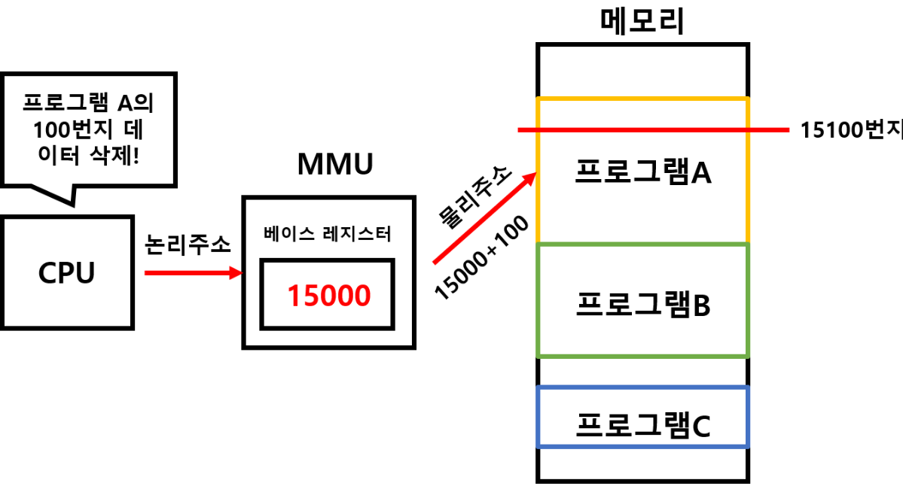
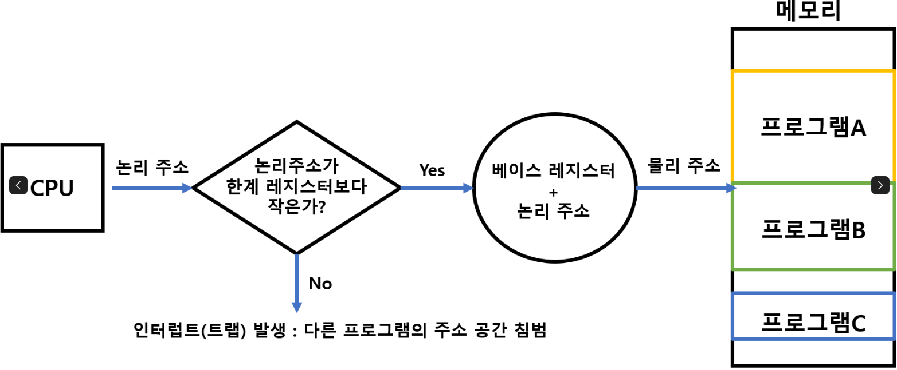
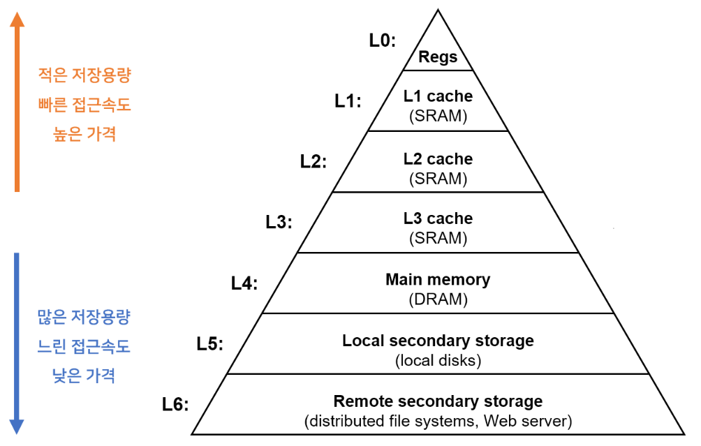
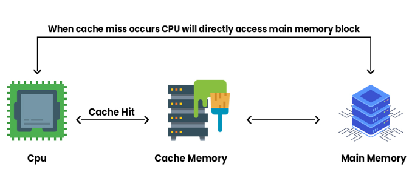

# 메모리와 캐시 메모리

## RAM의 특징과 종류

### RAM의 특징

- RAM에는 실행할 프로그램의 명령어와 데이터가 저장된다.
- 휘발성 저장 장치: 전원을 끄면 저장된 내용이 사라지는 저장 장치
  - ex. RAM
- 비휘발성 저장 장치: 전원이 꺼져도 저장된 내용이 유지되는 저장 장치

  - ex. 하드 디스크, SSD, CD-ROM, USB 메모리와 같은 보조기억장치가 대표적인 비휘발성 저장 장치

- 보조기억장치는 전원을 꺼도 내용을 유지하지만, CPU는 보조기억장치에 직접 접근이 불가능하다.
- 일반적으로 보조기억장치인 비휘발성 저장 장치에는 보관할 대상을 저장하고, 휘발성 저장 장치인 RAM에는 실행할 대상을 저장한다.

### RAM의 용량과 성능

- RAM 용량이 크면 많은 프로그램들을 동시에 빠르게 실행하는 데 유리하다
- 하지만, RAM 용량이 무지막지하게 크다고 해서 실행 속도가 그에 비례하지 않는다.

### RAM의 종류

- DRAM, SRAM, SDRAM, DDR SDRAM이 있다.

#### DRAM(Dynamic RAM)

- 저장된 데이터가 동적으로 변하는 RAM
- DRAM은 데이터의 소멸을 막기 위해 일정 주기로 데이터를 재활성화해야 한다.
- 시간이 지나면 저장된 데이터가 사라진다.
- 소비 전력이 비교적 낮고, 저렴하고, 집적도가 높기 때문에 대용량으로 설계하기 용이하기 때문에, 일반적으로 메모리로써 사용하는 RAM은 DRAM이다.

#### SRAM(Static RAM)

- 저장된 데이터가 변하지 않는 RAM (전원이 공급되지 않으면 데이터가 사라진다)
- SRAM은 DRAM보다 일반적으로 속도가 빠르다.
- SRAM은 DRAM보다 집적도가 낮고, 소비 전력도 크며, 가격도 더 비싸기 때문에 메모리로 잘 사용하지 않는다.
- SRAM은 메모리가 아닌 대용량으로 만들어질 필요는 없지만 속도가 빨라야 하는 저장 장치, 가령 캐시 메모리에서 사용된다.

#### SDRAM(Synchronous Dynamic RAM)

- 클럭 신호와 동기화된, 발전된 형태의 DRAM
- 클럭 신호와 동기화되었다는 말은 클럭 타이밍에 맞춰 CPU와 정보를 주고받을 수 있음을 의미한다.

#### DDR SDRAM(Double Data Rate SDRAM)

- 최근 가장 흔히 사용되는 RAM
- 대역폭을 넓혀 속도를 빠르게 만든 SDRAM이다.
- 대역폭(data rate)이란 데이터를 주고받는 길의 너비를 의미한다.
- 한 클럭당 하나씩 데이터를 주고받을 수 있는 SDRAM을 SDR SDRAM(Single Data Rate SDRAM)이라고 부루기도 한다.

## 메모리의 주소 공간

### 물리주소와 논리주소

**물리주소(physical address)**: 메모리 하드웨어가 사용하는 주소

**논리 주소(logical address)**: CPU와 실행중인 프로그램이 사용하는 주소

- 논리 주소와 물리 주소간의 변환은 CPU와 주소 버스 사이에 위치한 `메모리 관리 장치(MMU)`라는 하드웨어에 의해 수행된다.
- MMU는 CPU가 발생시킨 논리주소에 베이스 레지스터 값을 더하여 논리 주소를 물리 주소로 변환한다.
- 베이스 레지스터는 프로그램의 가장 작은 물리주소, 즉 프로그램의 첫 물리 주소를 저장하는 셈이고, 논리 주소는 프로그램의 시작점으로부터 떨어진 거리인 셈이다.

### 메모리 보호 기법

- 다른 프로그램의 영역을 침범할 수 있는 명령어는 위험하기 때문에 논리 주소 범위를 벗어나는 명령어 실행을 방지하고 실행 중인 프로그램이 다른 프로그램에 영향을 받지 않도록 보호할 방법이 필요하다. 이는 `한계 레지스터(limit register)`라는 레지스터가 담당한다.

`한계 레지스터`

- 프로그램의 영역을 침범할 수 있는 명령어의 실행을 막음
- 베이스 레지스터가 실행 중인 프로그램의 가장 작은 물리 주소를 저장한다면, 한계 레지스터는 논리 주소의 최대 크기를 저장
- 베이스 레지스터 값 <= 프로그램의 물리 주소 범위 < 베이스 레지스터 + 한계 레지스터 값

## 캐시 메모리

- CPU가 메모리에 접근하는 시간은 CPU의 연산 속도보다 느리다. CPU가 연산을 아무리 빨리 한다 해도 메모리에 접근하는 시간이 느리면 CPU의 빠른 연산 속도는 아무런 쓸모가 없을 것이다. 이를 극복하기 위한 장치가 `캐시 메모리`이다.

### 저장 장치 계층 구조(memory hierarchy)

- 빠른 저장장치는 가격이 높음, 적은 용량
- 느린 저장장치는 가격이 저렴, 대용량, 접근 속도 느림
- 메인 메모리까지는 cpu가 직접 접근 but, 밑의 하위계층은 접근 X
- 메인 메모리보다 아래 부분은 비휘발성 메모리
- 캐싱 기법 - 상대적으로 용량이 적은 빠른 저장장치를 이용해 느린 저장장치의 성능을 향상시키는 총체적 기법
  `저장 장치 계층 구조(memory hierarchy)`

- 컴퓨터가 사용하는 저장장치들은 'CPU에 얼마나 가까운가'를 기준으로 계층적으로 나타낸 것

### 캐시 메모리(cache memory)

- `캐리 메모리(cache memory)`는 CPU와 메모리 사이에 위치하고, 레지스터보다 용량이 크고 메모리보다 빠른 SRAM 기반의 저장 장치이다.
- 캐시 메모리는 CPU의 연산 속도와 메모리 접근 속도의 차이를 조금이니마 줄이기 위해 탄생했다.

- 캐시 메모리는 CPU(코어)와 가까운 순서대로 계층을 구성한다.
  - 코어와 가장 가까운 캐시 메모리를 L1(level 1) 캐시
  - 그 다음 가까운 캐시 메모리를 L2(level 2) 캐시
  - 그 다음 가까운 캐시 메모리를 L3(level 3) 캐시라고 부른다.

#### 분리형 캐시(split cache)

- L1 캐시는 조금이라도 접근 속도를 빠르게 만들기 위해 명령어만을 사용하는 L1 캐시인 L1I 캐시와 데이터만을 저장하는 L1 캐시인 L1D 캐시로 분리하는 경우도 있다. 이를 분리형 캐시라고 한다.

### 참조 지역성 원리(locality of reference, principle of locality)

- 메모리가 보조기억장치의 일부를 복사하여 저장하는 것처럼 캐시 메모리는 메모리의 일부를 복사하여 저장한다.

#### 캐시 히트(cache hit)

- 자주 사용될 것으로 예측한 데이터가 실제로 들어맞아 캐시 메모리 내 데이터가 CPU에서 활용될 경우

### 캐시 미스(cache miss)

- 자주 사용될 것으로 예측하여 캐시 메모리에 저장했지만, 예측이 틀려 메모리에서 필요한 데이터를 직접 가져와야 하는 경우

### 캐시 적중률(cache hit ratio)

- 캐시가 히트되는 비율 = 태시 히트 횟수 / (캐시 히트 횟수 + 캐시 미스 횟수 )
- 우리가 사용하는 컴퓨터의 캐시 적중률은 대략 85% ~ 95% 이상이다.

- 캐시 메모리는 `참조 지역성의 원리(locality of reference, principle of locality)` 한 가지 원칙에 따라 메모리로부터 가져올 데이터를 결정한다.
  1. CPU는 최근에 접근했던 메모리 공간에 다시 접근하려는 경향이 있다.
  2. CPU는 접근한 메모리 공간 근처를 접근하려는 경향이 있다.

#### 시간 지역성

- CPU는 최근에 접근했던 메모리 공간에 재접근하려는 경향이 있다.

#### 공간 지역성

- CPU는 접근한 메모리 공간 근처를 접근하려는 경향이 있다.

### 참고자료

[캐시 메모리 (캐시 일관성, 캐시의 쓰기 정책)](https://shuu.tistory.com/49)
