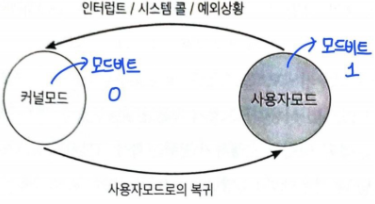

# 운영체제 시작하기

## OS란

- 컴퓨터 하드웨어 바로 위에 설치되어 사용자 및 다른 모든 소프트웨어와 하드웨어를 연결하는 소프트웨어 계층
- 컴퓨터 부팅 시 메모리 내 `커널 영역`이라는 공간에 따로 적재되어 실행

## 운영체제의 역할

1. 자원 관리

- 컴퓨터 시스템 자원 효율적 관리
- CPU 스케줄링, 메모리 관리, 인터럽트 서비스 루틴 실행

2. 자원 보호

- 프로그램이나 다른 사용자가 데이터를 삭제하거나 중요 파일에 접근하지 못하게 컴퓨터 자원 보호

3. 인터페이스 제공

- 하드웨어 인터페이스와 사용자 인터페이스를 제공하여 편리하게 사용하도록 지원

## 운영체제 구조

### 1. Kernel

- 프로세스 관리, 메모리 관리, 저장공간 관리, 연결된 장치 관리 등 컴퓨터에 속한 모든 자원을 관리하는 역할
- 사용자 인터페이스를 커널이 제공하지는 않는다.

### 2. Interface

- 사용자의 명령을 컴퓨터에 전달하고 결과를 사용자에게 알려주는 소통의 역할
- 대표적으로 GUI, CLI가 있다.

### 3. System Call

- 사용자나 프로그램이 직접적으로 컴퓨터 자원에 접근하는 것을 막고 커널을 보호하기 위해 만든 코드 집합
- System Call 함수를 통해 커널에 접근한다.
- System Call 예시
  1. 한 응용 프로그램이 하드 디스크에 데이터를 저장하려 함.
  2. 하지만 사용자 모드로(유저모드)로 실행되는 동안에는 자원(하드 디스크)에 접근할 수 없기에 커널 모드로 전환이 필요.
  3. 응용 프로그램은 하드 디스크에 데이터를 저장하는 시스템 호출을 발생시킴.
  4. 운영체제는 시스템 호출을 받고 커널 모드로 전환, 운영체제 내의 '하드 디스크 데이터를 저장하는 코드'를 실행.
  5. 필요한 하드 디스크로의 접근이 끝나면 다시 사용자 모드로 복귀하여 응용 프로그램 실행을 계속해 나감.

### Double Mode와 System Call

- CPU가 명령어를 실행하는 모드를 커널모드와 사용자 모드를 나누는 것을 말한다.

#### User Mode

- 일반적인 응용 프로그램은 기본적으로 사용자 모드로 실행된다.

#### Kernel Mode

- 운영체제가 CPU의 제어권을 가지고 운영체제 코드를 수행하는 모드
- 모든 종류의 명령을 전부 실행 가능
- 중요한 정보에 접근하는 연산은 커널모드에서만 실행할 수 있도록 통제하여 보안성을 확보
  

#### 모드 비트(Mode bit)

- 만약 사용자 프로그램이 cpu를 가지고 있는 동안에는 운영체제가 자신의 코드를 실행하지 못하므로 사용자 프로그램을 감시 못하는데 만약 이 때 사용자 프로그램이 프로그램 내에서 연산을 수행해버리면 제어가 소용이 없음
- Mode bit를 통해 하드웨어적으로 두 가지 모드의 operation 지원
  - 1 (사용자 모드): 사용자 프로그램 수행
  - 0 (커널 모드): OS 코드 수행
- 보안을 해칠 수 있는 중요한 명령어는 커널 모드에서만 수행 가능한 `특권명령`으로 규정
- Interrupt나 Exception 발생시 하드웨어가 mode bit 0으로 바꿈
- 만일 사용자 프로그램이 CPU의 제어권을 가진 상태에서 하드웨어 접근 등 보안이 필요한 중요한 명령을 수행해야할 경우 **시스템 콜**을 통해 운영체제가 대신해줄 것을 요청
- 사용자 프로그램에게 CPU를 넘기기 전에 mode bit 1로 바꿈
