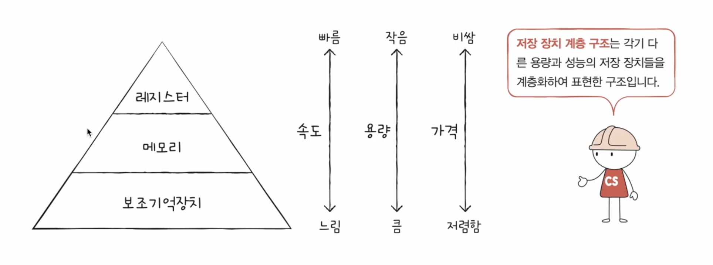
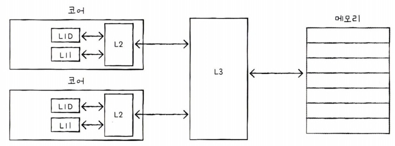

# Chapter06. 메모리와 캐시 메모리

## 06-1 RAM의 특징과 종류

### 1. RAM의 특징

- 실행할 프로그램의 명령어와 데이터가 저장됨
- 휘발성 저장 장치 - 전원을 끄면 저장된 명령어, 데이터가 날라감
- 비휘발성 저장 장치 - 하드 디스크, SSD, CD-ROM, USB 메모리 등
- 보조기억장치는 전원을 꺼도 내용을 유지하지만, CPU는 보조기억장치에 직접 접근하지 못함
- 보조기억장치(비휘발성 저장 장치)에는 '보관할 대상'을 저장, RAM(휘발성 저장 장치)에는 '실행할 대상' 저장
- CPU가 실행하고 싶은 프로그램이 보조기억장치에 있다면 이를 RAM으로 복사하여 저장한 뒤 실행

### 2. RAM의 용량과 성능

- RAM 용량이 적다면 보조기억장치에서 실행할 프로그램을 가져오는 일이 잦아 실행 시간이 길어짐
- RAM 용량이 충분히 크다면, 보조기억장체에 많은 데이터를 가져와 미리 RAM에 저장할 수 있음 => 많은 프로그램을 동시에 실행하는 데 유리
- RAM 용량이 필요 이상으로 커졌을 대 속도가 그에 비례하여 증가하지는 않음

### 3. RAM의 종류

- DRAM
  - Dynamic RAM
  - 저장된 데이터가 동적으로 변하는(사라지는) RAM
  - 시간이 지나면 저장된 데이터가 점차 사라지는 RAM
  - 데이터의 소멸을 막기 위해 일정 주기로 데이터를 재활성화해야 함
  - 일반적으로 메모리로써 사용하는 RAM
  - 소비 전력이 비교적 낮고, 저렴, 집적도가 높기 때문에 대용량으로 설계하기 용이
    - 집접도가 높다: 더 작고 빽빽하게 만들 수 있음
- SRAM
  - Static RAM
  - 저장된 데이터가 변하지 않는 RAM
  - 시간이 지나도 저장된 데이터가 사라지지 않음 => 전원이 공급되지 않으면 저장된 내용 사람짐은 동일
  - DRAM보다 일반적으로 속도도 더 빠름
  - 집적도가 낮고, 소비 전력이 큼, 가격 비쌈
  - 대용량으로 만들어질 필요는 없지만 속도가 빨라야 하는 저장 장치 => 캐시 메모리에서 사용됨
- SDRAM
  - 클럭 신호와 동기화된, 발전된 형태의 DRAM
  - 클럭 신호와 동기화되었다: 클럭 타이밍에 맞춰 CPU와 정보를 주고받을 수 있음을 의미
  - SDRAM은 클럭에 맞춰 동작하며 클럭마다 CPU와 정보를 주고받을 수 있는 DRAM
- DDR SDRAM
  - 최근 가장 흔히 사용되는 RAM
  - 대역폭을 넓혀 속도를 빠르게 만든 SDRAM
    - 대역폭: 데이터를 주고받는 길의 너비
  - 한 클럭에 하나씩 정보를 주고받을 수 있는 SDRAM과 비교했을 때 DDR SDRAM은 한 클럭당 두 번씩 CPU와 정보를 주고 받을 수 있음
    - 전송속도도 2배가량 빠름
  - 한 클럭 당 하나씩 데이터를 주고받을 수 있는 SDRAM을 SDR SDRAM이라고 부르기도 함
  - DDR2 SDRAM은 DDR SDRAM보다 대역폭이 두 배 넓은 SDRAM = DDR2 SDRAM은 SDR SDRAM보다 너비가 네 배 넓은 SDRAM
  - DDR3 SDRAM은 DDR2 SDRAM보다 대역폭이 두 배 넓은 SDRAM = SDR SDRAM보다 대역폭이 여덟 배 넒은 SDRAM
  - 최근 흔히 사용하는 메모리는 DDR4 SDRAM

## 06-2 메모리의 주소 공간

### 1. 물리 주소와 논리 주소

- 물리 주소
  - 메모리가 사용하는 주소
  - 정보가 실제로 저장된 하드웨어상의 주소를 의미
- 논리 주소
  - CPU와 실행 중인 프로그램이 사용하는 주소
  - 실행 중인 프로그램 각각에게 부여된 0번지부터 시작되는 주소를 의미
- 메모리 관리 장치(MMU)
  - 논리 주소와 물리 주소 간의 변환이 수행됨
  - CPU와 주소 버스 사이에 위치
  - CPU가 발생시킨 논리 주소에 베이스 레지스터 값을 더하여 논리 주소를 물리 주소로 변환
  - 베이스 레지스터: 프로그램의 가장 작은 물리 주소, 프로그램의 첫 물리 주소를 저장
  - 논리 주소는 프로그램의 시작점으로부터 떨어진 거리

### 2. 메모리 보호 기법

- 한계 레지스터: 논리 주소 범위를 벗어나는 명령어 실행을 방지하고 실행 중인 프로그램이 다른 프로그램에 영향을 받지 않도록 함
- 논리 주소의 최대 크기를 저장함
- CPU가 접근하려는 논리 주소는 한계 레지스터가 저장한 값보다 커서는 안됨
- CPU는 메모리에 접근하기 전에 접근하고자 하는 논리 주소가 한계 레지스터보다 작은지를 검사함
- 만약 CPU가 한계 레지스터보다 높은 논리 주소에 접근하려고 하면 인터럽트를 발생시켜 실행을 중단함

## 06-3 캐시 메모리

### 1. 저장 장치 계층 구조

- 낮은 가격대의 대용량 저장 장치를 원한다면 느린 속도는 감수해야 하고, 빠른 메모리를 원한다면 작은 용량과 비싼 가격은 감수해야 함
- 저장 장치 계층 구조: CPU에 얼마나 가가운가를 기준으로 계층적으로 나타냄
  - 

### 2. 캐시 메모리

- CPU가 메모리에 접근하는 속도는 레지스터에 접근하는 속도보다 느림
- 캐시 메모리: CPU와 메모리 사이에 위치, 레지스터보다 용량이 크고 메모리보다 빠른 SDRAM 기반의 저장 장치
- 메모리에서 CPU가 사용할 일부 데이터를 미리 캐시 메모리로 가지고 와서 활용
- 캐시 메모리에 CPU가 필요로 하는 데이터가 있다면 필요한 데이터로의 접근 시간을 줄일 수 있음
- 컴퓨터 내부에는 여러 개의 캐시 메모리가 있음
- CPU와 가까운 순서대로 계층을 구성함
  - 코어와 가장 가까운 캐시 메모리를 L1 캐시
  - 그 다음 가까운 캐시 메모리를 L2 캐시
  - 그 다음 L3 캐시 -> 일반적으로 코어 외부에 위치
  - 캐시 메모리의 용량은 순차적으로 커지고, 속도는 느려짐, 가격은 저렴해짐
  - 멀티 코어 프로세서에서 L1-L2-L3 캐시 구현 이미지
    - 
    - L1 캐시와 L2 캐시는 코어마다 고유한 캐시 메모리로 할당, L3 캐시는 여러 코어가 공유하는 형태로 사용됨

### 3. 참조 지역성 원리

- CPU가 사용할 법한 대상을 예측하여 저장
- 캐시 히트: 자주 사용될 것으로 예측한 데이터가 실제로 들어맞아 캐시 메모리 내 데이터가 CPU에서 활용되는 경우
- 캐시 미스: 자주 사용될 것으로 예측하여 캐시 메모리에 저장했지만, 예측이 틀려 메모리에서 필요한 데이터를 직접 가져와야 하는 경우
- 캐시 미스가 자주 발생하면 성능은 떨어짐
- 캐시 적중률: 캐시 히트 횟수 / (캐시 히트 횟수 + 캐시 미스 횟수)
- 참조 지역성의 원리
  - 메모리로부터 가져올 데이터를 결정하는 원칙
  - CPU가 메모리에 접근할 때의 주된 경향을 바탕으로 만들어진 원리
  - 시간 지역성: CPU는 최근에 접근했던 메모리 공간에 다시 접근하려는 경향이 있음
    - CPU는 변수가 저장된 메모리 공간을 언제든 다시 참조할 수 있음
    - 변수에 저장된 값은 일반적으로 한 번만 사용되지 않고 여러 번 사용됨
    - CPU는 최근에 접근했던 메모리 공간에 여러 번 다시 접근할 수 있음
  - 공간 지역성: CPU는 접근한 메모리 공간 근처에 접근하려는 경향이 있음
    - 하나의 프로그램 내에서도 관련 있는 데이터들은 모여서 저장됨
    - CPU가 워드 프로세서 프로그램을 실행할 적에는 워드 프로세서 프로그램이 모여 있는 공간 근처를 집중적으로 접근할 것
